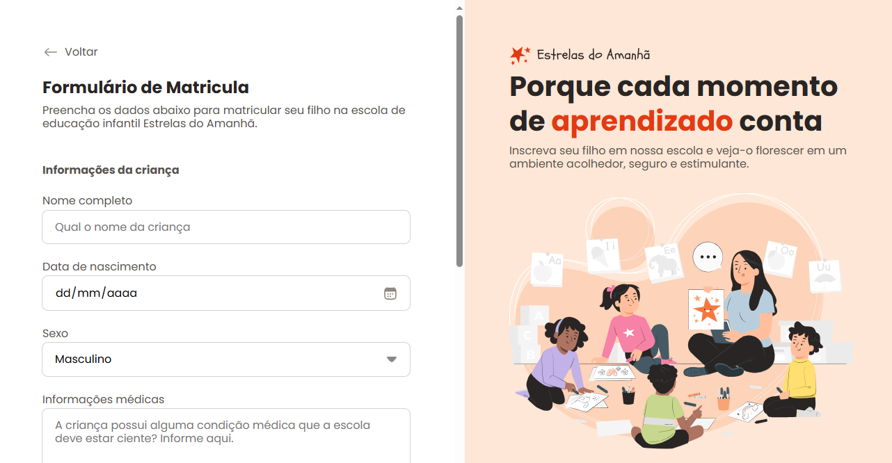

# 🏫 Formulário de Matrícula - Escola Estrela do Amanhã

Um formulário de matrícula responsivo e acessível desenvolvido para a escola **Estrela do Amanhã**. O projeto foi construído com HTML e CSS, seguindo boas práticas de desenvolvimento e design.
---

## 📋 Funcionalidades

- **Formulário de Matrícula Completo**:
  - Captura de informações da criança, responsável e endereço.
  - Seleção de turno de estudo e esportes.
  - Aceitação dos termos e condições.

- **Validação de Campos**:
  - Validação em tempo real de campos obrigatórios.
  - Feedback visual para campos inválidos.

- **Design Responsivo**:
  - Layout adaptável para diferentes tamanhos de tela.
  - Experiência de usuário consistente em dispositivos móveis e desktop.

- **Acessibilidade**:
  - Uso de `aria-label` e `aria-invalid` para melhorar a acessibilidade.
  - Foco visível e navegação via teclado.

---

## 🛠️ Tecnologias Utilizadas

- **HTML5**: Estrutura semântica do formulário.
- **CSS3**: Estilização avançada com variáveis CSS e flexbox/grid.
- **VS Code**: Editor .❤.
- **Figma**: Design do Projeto.
- **Git**: Versionamento.
- **Vercel**: Deploy.

---

## 🎨 Design

O design do projeto foi pensado para ser **moderno**, **intuitivo** e **acessível**.
Cores, tipografia e espaçamentos foram cuidadosamente escolhidos para garantir uma experiência agradável ao usuário.

---

## 📂 Estrutura do Projeto

```plaintext
formulario-matricula-web/
├── assets/
│   ├── icons/          # Ícones utilizados no projeto
│   └── image/          # Imagens ilustrativas
├── css/
│   ├── fields/
│   │    ├── buttons.css    # Estilos específicos para os butoes
│   │    ├── checkbox.css   # Estilos específicos para o checkbox
│   │    ├── dropbox.css    # Estilos específicos para o campo de upload file
│   │    ├── index.css      # Arquivo central
│   │    ├── input.css      # Estilos específicos para os inputs
│   │    └── radio.css      # Estilos para botões
│   ├── global.css          # root
│   ├── form.css            # Estilos gerais do formulário
│   ├── layout.css          # Estilo para o layout
│   └── styles.css          # Arquivo principal de estilos
├── docs/
│   └── ...             # Contém todos os Stage do projeto
├── index.html          # Página principal do formulário
└── README.md           # README.md
```

---

## 🚀 Como Executar o Projeto

1. **Clone o repositório**:

   ```bash
   git clone https://github.com/seu-usuario/formulario-matricula-web.git
   ```

2. **Abra o projeto**:
   - Navegue até a pasta do projeto:

     ```bash
     cd formulario-matricula-web
     ```

   - Abra o arquivo `index.html` no seu navegador.

3. **Explore o formulário**:
   - Preencha os campos e teste as validações.
   - Verifique a responsividade em diferentes dispositivos.

## 🙌 Contribuições

Contribuições são bem-vindas! Siga os passos abaixo:

1. Faça um fork do projeto.
2. Crie uma branch para sua feature (`git checkout -b feature/nova-feature`).
3. Commit suas mudanças (`git commit -m 'Adiciona nova feature'`).
4. Push para a branch (`git push origin feature/nova-feature`).
5. Abra um Pull Request.

---

## 📧 Links

Se tiver alguma dúvida ou sugestão, entre em contato:

- **E-mail**: [devmoisessantos@gmail.com]
- **GitHub**: [devmoisessantos](https://github.com/devmoisessantos)
- [**Veja aqui**](https://formulario-matricula-web.vercel.app/))

---

Feito com ❤️ por [Moises M Santos] 👋
